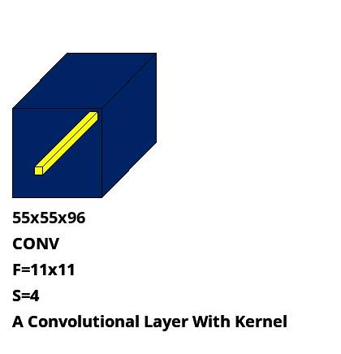

# dl-drawer: Deep Learning Architectures Drawer Tool 
A python module to automate drawing for various deep learning architectures. 

## Motivation: Why we might need dl-drawer
- I felt that sometimes drag and drop with precise and required scale factor is quite annoying task. This tool helps to draw based on your given precise measurements of height, width and depth of various shapes (3D Rectangles,  2D Rectangles). You can scale and customize the shapes, design and their placements as per your accord. 

- This tool tries to put all the blocks of deep learning architectures horizontally which is specially very helpful to draw architectures like AlexNet, VGG or at least gives you a basic boost up in this regard.  

## Installation
```commandline
pip install -r requirements.txt 
```
## Basic Usage and Examples 
Example of AlexNet Generated using this library. 
```commandline
from dl_drawer import DLDrawer

obj = DLDrawer(width=None, height=None)

obj.add_multi_plane_image(component_gap=5, width=227, height=227, factor=1, plane_number=3,
                          colors=["red", "green", "blue"], grid=True, grid_gap=5, grid_color="black", texts="Image",
                          line_gap=2, plane_shift=5)

obj.add_arrow_with_text(component_gap=5, length=30, triangle_size=5, texts=[], line_gap=1)

obj.add_cube(width=55, height=55, factor=2, depth=96, texts=["CONV", "F=11x11", "S=4", "Same"], angle=45,
             color="#002366", kernel_size=5,
             filter_color="yellow", line_gap=10, component_gap=5)

obj.add_arrow_with_text(component_gap=5, length=30, triangle_size=5, texts=["Max", "Pool"], line_gap=1)

obj.add_cube(width=27, height=27, factor=2, depth=256, texts=["CONV", "F=5x5", "S = 1", "Same"], angle=45,
             color="#002366", kernel_size=3,
             filter_color="yellow", line_gap=10, component_gap=5)

obj.add_arrow_with_text(component_gap=5, length=30, triangle_size=5, texts=["Max", "Pool"], line_gap=1,
                        forced_x_change=-50)

obj.add_cube(width=13, height=13, factor=2, depth=384, texts=["CONV", "F=3x3", "S = 1", "Same"], angle=45,
             color="#002366", kernel_size=3,
             filter_color="yellow", line_gap=10, component_gap=5)

obj.add_arrow_with_text(component_gap=5, length=30, triangle_size=5, texts=[], line_gap=1, forced_x_change=-150)

obj.add_cube(width=13, height=13, factor=2, depth=384, texts=["CONV", "F=3x3", "S = 1", "Same"], angle=45,
             color="#002366", kernel_size=3,
             filter_color="yellow", line_gap=10, component_gap=5)

obj.add_arrow_with_text(component_gap=5, length=30, triangle_size=5, texts=["Max", "Pool"], line_gap=1,
                        forced_x_change=-100)

obj.add_cube(width=13, height=13, factor=2, depth=256, texts=["CONV", "F=3x3", "S = 1", "Same"], angle=45,
             color="#002366", kernel_size=2,
             filter_color="yellow", line_gap=10, component_gap=5)

obj.add_arrow_with_text(component_gap=5, length=30, triangle_size=5,
                        texts=["Max", "Pool", "F=2x2", "S = 2", "Same"], line_gap=1, forced_x_change=-50)
obj.add_cube(width=4, height=4, factor=2, depth=90, texts=["Pool", "6x6x256"], angle=45, color="#FFAA1D",
             kernel_size=None,
             filter_color="yellow", line_gap=10, component_gap=5)

obj.add_arrow_with_text(component_gap=5, length=30, triangle_size=5, texts=["Flatten"], line_gap=1)
obj.add_rectangle(component_gap=5, width=30, height=300, color="#800020", grid=False, grid_gap=5,
                  grid_color="black",
                  circle=False, circle_color="white", cycle_gap=5, texts=["FC", "4096"])
obj.add_arrow_with_text(component_gap=5, length=30, triangle_size=5, texts=[""], line_gap=1)
obj.add_rectangle(component_gap=5, width=30, height=300, color="#800020", grid=False, grid_gap=5,
                  grid_color="black",
                  circle=False, circle_color="white", cycle_gap=5, texts=["FC", "4096"])
obj.add_arrow_with_text(component_gap=5, length=30, triangle_size=5, texts=["Softmax"], line_gap=1)
obj.add_rectangle(component_gap=5, width=30, height=100, color="#FF8A8A", grid=False, grid_gap=5,
                  grid_color="black",
                  circle=False, circle_color="white", cycle_gap=5, texts=["FC", "8"])

obj.render("alex_net.jpg")

```

- AlextNet Generated Using this library 

## Shapes and Functions
Currently, we support following shapes,
- Cube 



```commandline
obj.add_cube(width=55, height=55, factor=2, depth=96, texts=["CONV", "F=11x11", "S=4", "A Convolutional Layer With Kernel"], angle=45,
                 color="#002366", kernel_size=5,
                 filter_color="yellow", line_gap=10, component_gap=5)
```

- Rectangle 


```commandline
obj.add_rectangle(component_gap=5, width=30, height=100, color="#FF8A8A", grid=False, grid_gap=5,
                      grid_color="black",
                      circle=True, circle_color="white", cycle_gap=5, texts=["FC", "8"])

```

- Multi Plane Rectangles 


```commandline
obj.add_multi_plane_image(component_gap=5, width=227, height=227, factor=1, plane_number=3,
                              colors=["red", "green", "blue"], grid=True, grid_gap=5, grid_color="black", texts="Image",
                              line_gap=2, plane_shift=5)
```

- Arrow with Text

```commandline
obj.add_arrow_with_text(component_gap=5, length=100, triangle_size=5, texts=["Arrow", "with text"], line_gap=1)
```


## Common Function Parameters
These are some of the common attributes that you can tweak and customize your architecture's each component shape

- ``width``: Width of the rectangle or cubic shapes
- ``height``: Height of the rectangle or cubic shapes 
- ``depth``: Depth of the cubic shapes 
- ``kernel_size``: Size of the kernel or filer, e.g, 3 for (3 x 3)
- ``factor``: Factor that is multiplied with width, height, depth and kernel size to scale
- ``texts``: A list of strings or a single string, that will be written. For the list of strings, each one will be written one after one.
- ``angle``: Angle in degrees to control the slope of cubic shapes' sides. Default value ``45``
- ``color``: Color of the corresponding shape which will be used to fill. Default ``grey``
- ``filter_color``: Color of the filter that is placed within cubic shapes. Default ``yellow``
- ``line_gap``: Line gap in pixels between multi line texts. Default ``1``
- ``component_gap``: Horizontal gap in pixels between two components placed side by side. Default ``10``
- ``forced_x_change``: The placement of each component is automatically calculated. But you can enforce the change applying value here. Default ``0``. It enforces change in x-axis.
- ``forced_y_change``: This enforces change in y-axis. Default value for both forced changes is ``0``. 

``grid=False``, ``grid_gap=5``, ``grid_color="black"`` attributes are available for ``add_rectangle`` functions to control the drawn grades. These attributes are also available for `` add_multi_plane_image`` function. ``add_multi_plane_image`` function also contains another attribute named as ``plane_shift`` to control the gap in x-axis among the adjacent planes. 

``circle=True, circle_color="white", cycle_gap=5,``, attributes are also available to draw circles representing neurons for ``add_rectangle`` function. 

If ``kernel_size`` is none then kernels are omitted from drawn in cubic shapes. 

The design is fairly very simple. ``dl_drawer.py`` controls all the algorithm and logic. 


## Support and Contributions
- For any kind of support please email me at rizveeredwan.csedu@gmail.com